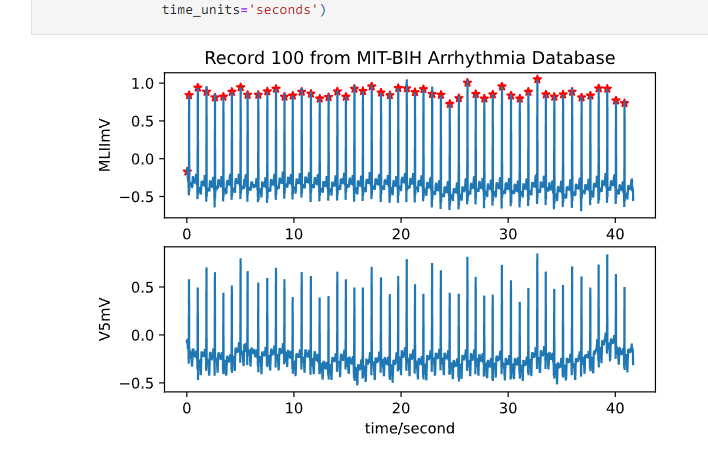
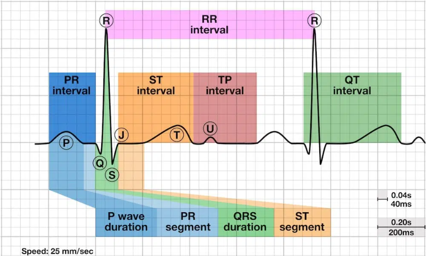

# EDA
## 数据源
https://physionet.org/content/picsdb/1.0.0/

## 测试

测试

## 一些参考链接 
EDA Example https://colab.research.google.com/drive/19b9IhncD3AVdCVVZ3oGHs80ZcgTj0d-w?usp=sharing

wfdb Demo

https://github.com/MIT-LCP/wfdb-python/blob/main/demo.ipynb


## 20230124 （这部分的更新在ECG.ipynb，EDA主线在EDA.ipynb）

（1） 关于annotations这部分，提供的文件里应该是没有annotation的，我拆解的多个infant数据里annotation都是空，也无法正常标记；另外第七组这个不是annotation是峰值

(这个是标记)



（2）不过峰值对我们也有用，我们可以自己加标记，因为标记正常和不正常也是心率范围定的，转换心率的方法我记得有了，到时候能根据这些判断一下打标签，生成excel，后面就好说了，就能对的上DR之前课堂上给的EDA流程了


(3) TODO：根据ECG的peak的合理范围判断来打上annotation并据此给正常?非正常的婴儿分类（EDA有些图表很复杂，因此给截取的数据都实际情况判断来annotation也是需要的）


> 目前的发现，ecg转换BPM很复杂，目前我们要做的也是resp和ecg的关系，不建议用bpm范围校准

> 建议研究ecg自身的频率分布来，ecg的y 轴（垂直）表示 ECG 波形的振幅，以毫伏为单位测量。 一个大方块代表 0.5 mV，一个小方块代表 0.1 mV。 


## 20230125



### segments


### waveforms
`f = 1 / T `  frequency formula


```py
单个的
x_ecg_full：全部ecg数据
x_resp_full:全部resp数据
fs_ecg: ecg的采样率
fs_resp: resp的采样率
```
输出信息
```
Loading ECG file:  infant2_ecg
Loading RESP file:  infant2_resp
ECG sampling frequency:  500  Hz
RESP sampling frequency:  50  Hz
ECG sampling interval dt =  0.002  sec.
RESP sampling interval dt =  0.02  sec.
```

### 预装数据说明
* infantIndexesReadyArr : 要研究的婴儿文件索引数字(1, 2, 3, 10)都OK

### Step2 -> 封装函数说明

获取每个婴儿的相关信息，便于后来resampling或者取R波
```python
def GetRelevantDataForTargetSegment(data_dir, file_index):
  x_ecg_full, x_resp_full, fs_ecg, fs_resp = load_waveforms(data_dir, file_index)
  return {"x_ecg_full": x_ecg_full, "e_resp_full": x_resp_full, "fs_ecg": fs_ecg, "fs_resp": fs_resp}
```

> ecg_full和resp_full就是每个婴儿独自的数据(数据结构中的sig_p)
> fs_ecg, fs_ecg是采样频率,这个是数据源给定的

DS示例
```
{'infant2': {'x_ecg_full': array([-0.00982986, -0.01474478, -0.01474478, ...,  0.10321349,
        0.10894757,  0.10976672]), 'e_resp_full': array([21.92315057, 22.01228904, 22.14775144, ..., 22.99842723,
       23.04896243, 23.05176994]), 'fs_ecg': 500, 'fs_resp': 50}, 'infant3': {'x_ecg_full': array([ 0.09467079,  0.09993028,  0.09467079, ..., -0.83976496,
       -0.91427437, -0.94407814]), 'e_resp_full': array([-1.38832109, -1.37854909, -1.39250908, ..., 24.72174772,
       24.79782967, 24.94022157]), 'fs_ecg': 500, 'fs_resp': 50}}
```


从segments中截取每个婴儿所需的合适分段
```python
# 定义
def ClipDataToSegmentBorders(segments, file_index, segment_index):
   t0_sec, t1_sec = segments[f"infant{file_index:d}"][segment_index]
   t0_sample_ecg = round(t0_sec * fs_ecg)
   t1_sample_ecg = round(t1_sec * fs_ecg)
   t0_sample_resp = round(t0_sec * fs_resp)
   t1_sample_resp = round(t1_sec * fs_resp)
   return {"t0_sample_ecg": t0_sample_ecg, "t1_sample_ecg": t1_sample_ecg, "t0_sample_resp": t0_sample_resp, "t1_sample_resp": t1_sample_resp}

# 使用
infantsBordersObj = {}
for infant in relevantDataArr.values():
  # by default, the segment_index here is 0, means I will use the first segment tuple of every infant 
  infantsBordersObj[f"infant{infant['file_index']}"] = ClipDataToSegmentBorders(segments=segments, file_index=infant['file_index'], segment_index=segment_index)
```


## step3: 封装函数说明

以给定的区间内，从每个婴儿的数据中截取并获得指定的ecg_x,resp_x数据
```py
# define
def ExtractPairedDataByIntervalsAndFlatThem(t0_sample_ecg, t1_sample_ecg, t0_sample_resp, t1_sample_resp):
  x_ecg = x_ecg_full[t0_sample_ecg:t1_sample_ecg] 
  x_resp = x_resp_full[t0_sample_resp:t1_sample_resp]
  return x_ecg, x_resp
```